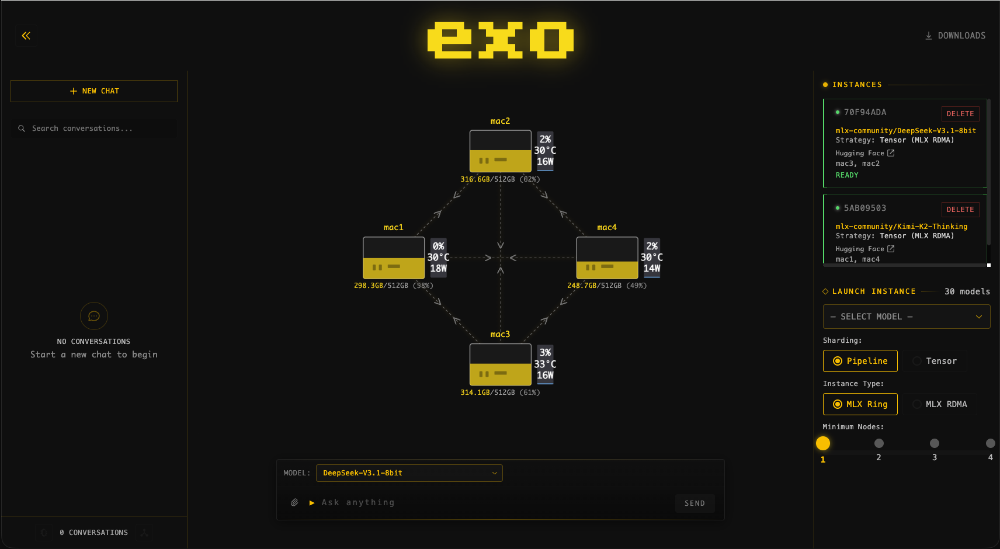
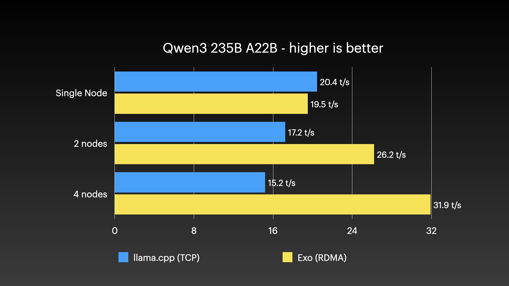
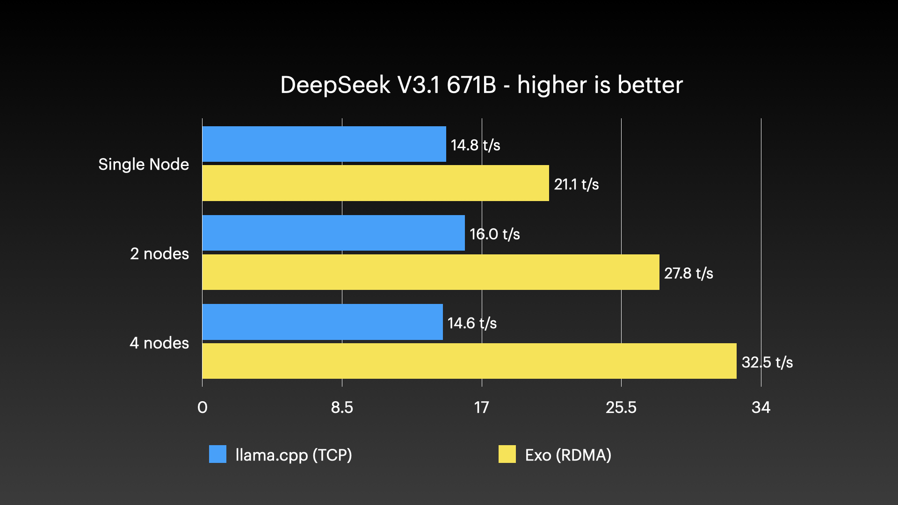
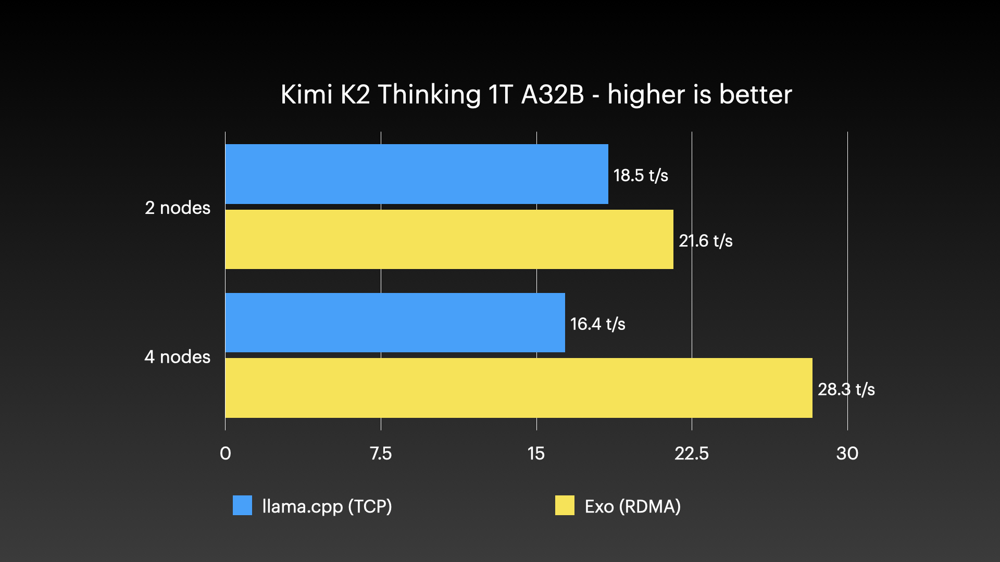
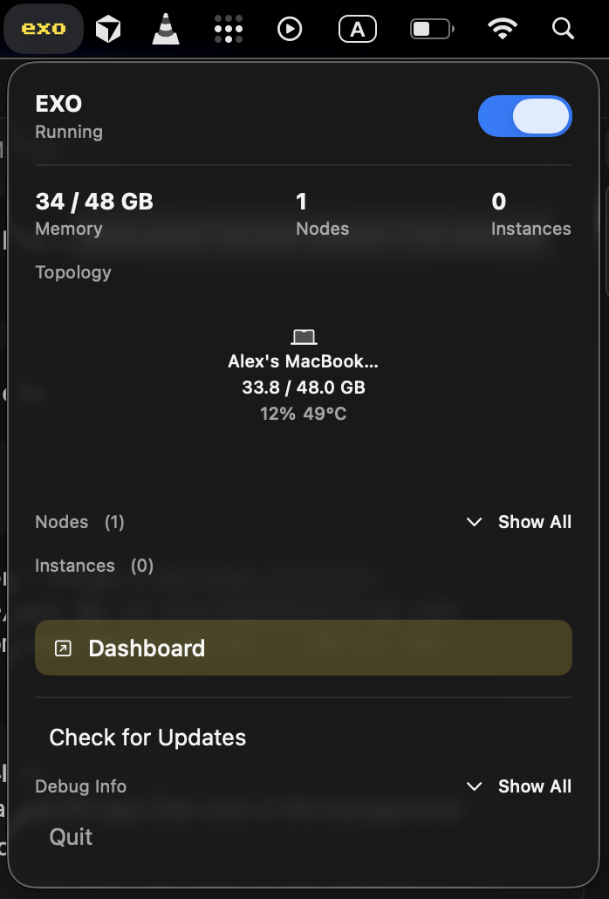

<div align="center">

<picture>
  <source media="(prefers-color-scheme: light)" srcset="/docs/imgs/exo-logo-black-bg.jpg">
  
</picture>

exo: Run your own AI cluster at home with everyday devices. Maintained by [exo labs](https://x.com/exolabs).

<p align="center">
  <a href="https://discord.gg/TJ4P57arEm" target="_blank" rel="noopener noreferrer"></a>
  <a href="https://x.com/exolabs" target="_blank" rel="noopener noreferrer"></a>
  <a href="https://www.apache.org/licenses/LICENSE-2.0.html" target="_blank" rel="noopener noreferrer"></a>
</p>

</div>

---

exo connects all your devices into an AI cluster. Not only does exo enable running models larger than would fit on a single device, but with [day-0 support for RDMA over Thunderbolt](https://x.com/exolabs/status/2001817749744476256?s=20), makes models run faster as you add more devices.

## Features

- **Automatic Device Discovery**: Devices running exo automatically discover each other - no manual configuration.
- **RDMA over Thunderbolt**: exo ships with [day-0 support for RDMA over Thunderbolt 5](https://x.com/exolabs/status/2001817749744476256?s=20), enabling 99% reduction in latency between devices.
- **Topology-Aware Auto Parallel**: exo figures out the best way to split your model across all available devices based on a realtime view of your device topology. It takes into account device resources and network latency/bandwidth between each link.
- **Tensor Parallelism**: exo supports sharding models, for up to 1.8x speedup on 2 devices and 3.2x speedup on 4 devices.
- **MLX Support**: exo uses [MLX](https://github.com/ml-explore/mlx) as an inference backend and [MLX distributed](https://ml-explore.github.io/mlx/build/html/usage/distributed.html) for distributed communication.

## Dashboard

exo includes a built-in dashboard for managing your cluster and chatting with models.

<p align="center">
  
</p>
<p align="center"><em>4 × 512GB M3 Ultra Mac Studio running DeepSeek v3.1 (8-bit) and Kimi-K2-Thinking (4-bit)</em></p>

## Benchmarks

<details>
  <summary>Qwen3-235B (8-bit) on 4 × M3 Ultra Mac Studio with Tensor Parallel RDMA</summary>
  
  <p>
    <strong>Source:</strong> <a href="https://www.jeffgeerling.com/blog/2025/15-tb-vram-on-mac-studio-rdma-over-thunderbolt-5">Jeff Geerling: 15 TB VRAM on Mac Studio – RDMA over Thunderbolt 5</a>
  </p>
</details>

<details>
  <summary>DeepSeek v3.1 671B (8-bit) on 4 × M3 Ultra Mac Studio with Tensor Parallel RDMA</summary>
  
  <p>
    <strong>Source:</strong> <a href="https://www.jeffgeerling.com/blog/2025/15-tb-vram-on-mac-studio-rdma-over-thunderbolt-5">Jeff Geerling: 15 TB VRAM on Mac Studio – RDMA over Thunderbolt 5</a>
  </p>
</details>

<details>
  <summary>Kimi K2 Thinking (native 4-bit) on 4 × M3 Ultra Mac Studio with Tensor Parallel RDMA</summary>
  
  <p>
    <strong>Source:</strong> <a href="https://www.jeffgeerling.com/blog/2025/15-tb-vram-on-mac-studio-rdma-over-thunderbolt-5">Jeff Geerling: 15 TB VRAM on Mac Studio – RDMA over Thunderbolt 5</a>
  </p>
</details>

---

## Quick Start

Devices running exo automatically discover each other, without needing any manual configuration. Each device provides an API and a dashboard for interacting with your cluster (runs at `http://localhost:52415`).

There are two ways to run exo:

### Run from Source (macOS)

**Prerequisites:**
- [brew](https://github.com/Homebrew/brew) (for simple package management on macOS)
  
  ```bash
  /bin/bash -c "$(curl -fsSL https://raw.githubusercontent.com/Homebrew/install/HEAD/install.sh)"
  ```
- [uv](https://github.com/astral-sh/uv) (for Python dependency management)
- [macmon](https://github.com/vladkens/macmon) (for hardware monitoring on Apple Silicon)
- [node](https://github.com/nodejs/node) (for building the dashboard)
  
  ```bash
  brew install uv macmon node
  ```
- [rust](https://github.com/rust-lang/rustup) (to build Rust bindings, nightly for now)

  ```bash
  curl --proto '=https' --tlsv1.2 -sSf https://sh.rustup.rs | sh
  rustup toolchain install nightly
  ```

Clone the repo, build the dashboard, and run exo:

```bash
# Clone exo
git clone https://github.com/exo-explore/exo

# Build dashboard
cd exo/dashboard && npm install && npm run build && cd ..

# Run exo
uv run exo
```

This starts the exo dashboard and API at http://localhost:52415/

### Run from Source (Linux)

**Prerequisites:**

- [uv](https://github.com/astral-sh/uv) (for Python dependency management)
- [node](https://github.com/nodejs/node) (for building the dashboard) - version 18 or higher
- [rust](https://github.com/rust-lang/rustup) (to build Rust bindings, nightly for now)

**Installation methods:**

**Option 1: Using system package manager (Ubuntu/Debian example):**
```bash
# Install Node.js and npm
sudo apt update
sudo apt install nodejs npm

# Install uv
curl -LsSf https://astral.sh/uv/install.sh | sh

# Install Rust (using rustup)
curl --proto '=https' --tlsv1.2 -sSf https://sh.rustup.rs | sh
rustup toolchain install nightly
```

**Option 2: Using Homebrew on Linux (if preferred):**
```bash
# Install Homebrew on Linux
/bin/bash -c "$(curl -fsSL https://raw.githubusercontent.com/Homebrew/install/HEAD/install.sh)"

# Install dependencies
brew install uv node

# Install Rust (using rustup)
curl --proto '=https' --tlsv1.2 -sSf https://sh.rustup.rs | sh
rustup toolchain install nightly
```

**Note:** The `macmon` package is macOS-only and not required for Linux.

Clone the repo, build the dashboard, and run exo:

```bash
# Clone exo
git clone https://github.com/exo-explore/exo

# Build dashboard
cd exo/dashboard && npm install && npm run build && cd ..

# Run exo
uv run exo
```

This starts the exo dashboard and API at http://localhost:52415/

**Important note for Linux users:** Currently, exo runs on CPU on Linux. GPU support for Linux platforms is under development. If you'd like to see support for your specific Linux hardware, please [search for existing feature requests](https://github.com/exo-explore/exo/issues) or create a new one.

**Configuration Options:**

- `--no-worker`: Run exo without the worker component. Useful for coordinator-only nodes that handle networking and orchestration but don't execute inference tasks. This is helpful for machines without sufficient GPU resources but with good network connectivity.

  ```bash
  uv run exo --no-worker
  ```

**File Locations (Linux):**

exo follows the [XDG Base Directory Specification](https://specifications.freedesktop.org/basedir-spec/basedir-spec-latest.html) on Linux:

- **Configuration files**: `~/.config/exo/` (or `$XDG_CONFIG_HOME/exo/`)
- **Data files**: `~/.local/share/exo/` (or `$XDG_DATA_HOME/exo/`)
- **Cache files**: `~/.cache/exo/` (or `$XDG_CACHE_HOME/exo/`)

You can override these locations by setting the corresponding XDG environment variables.

### macOS App

exo ships a macOS app that runs in the background on your Mac.



The macOS app requires macOS Tahoe 26.2 or later.

Download the latest build here: [EXO-latest.dmg](https://assets.exolabs.net/EXO-latest.dmg).

The app will ask for permission to modify system settings and install a new Network profile. Improvements to this are being worked on.

**Custom Namespace for Cluster Isolation:**

The macOS app includes a custom namespace feature that allows you to isolate your exo cluster from others on the same network. This is configured through the `EXO_LIBP2P_NAMESPACE` setting:

- **Use cases**:
  - Running multiple separate exo clusters on the same network
  - Isolating development/testing clusters from production clusters
  - Preventing accidental cluster joining

- **Configuration**: Access this setting in the app's Advanced settings (or set the `EXO_LIBP2P_NAMESPACE` environment variable when running from source)

The namespace is logged on startup for debugging purposes.

#### Uninstalling the macOS App

The recommended way to uninstall is through the app itself: click the menu bar icon → Advanced → Uninstall. This cleanly removes all system components.

If you've already deleted the app, you can run the standalone uninstaller script:

```bash
sudo ./app/EXO/uninstall-exo.sh
```

This removes:
- Network setup LaunchDaemon
- Network configuration script
- Log files
- The "exo" network location

**Note:** You'll need to manually remove EXO from Login Items in System Settings → General → Login Items.

---

### Enabling RDMA on macOS

RDMA is a new capability added to macOS 26.2. It works on any Mac with Thunderbolt 5 (M4 Pro Mac Mini, M4 Max Mac Studio, M4 Max MacBook Pro, M3 Ultra Mac Studio).

Note that on Mac Studio, you cannot use the Thunderbolt 5 port next to the Ethernet port.

To enable RDMA on macOS, follow these steps:

1. Shut down your Mac.
2. Hold down the power button for 10 seconds until the boot menu appears.
3. Select "Options" to enter Recovery mode.
4. When the Recovery UI appears, open the Terminal from the Utilities menu.
5. In the Terminal, type:
   ```
   rdma_ctl enable
   ```
   and press Enter.
6. Reboot your Mac.

After that, RDMA will be enabled in macOS and exo will take care of the rest.

---

### Using the API

If you prefer to interact with exo via the API, here is an example creating an instance of a small model (`mlx-community/Llama-3.2-1B-Instruct-4bit`), sending a chat completions request and deleting the instance.

---

**1. Preview instance placements**

The `/instance/previews` endpoint will preview all valid placements for your model.

```bash
curl "http://localhost:52415/instance/previews?model_id=llama-3.2-1b"
```

Sample response:

```json
{
  "previews": [
    {
      "model_id": "mlx-community/Llama-3.2-1B-Instruct-4bit",
      "sharding": "Pipeline",
      "instance_meta": "MlxRing",
      "instance": {...},
      "memory_delta_by_node": {"local": 729808896},
      "error": null
    }
    // ...possibly more placements...
  ]
}
```

This will return all valid placements for this model. Pick a placement that you like.
To pick the first one, pipe into `jq`:

```bash
curl "http://localhost:52415/instance/previews?model_id=llama-3.2-1b" | jq -c '.previews[] | select(.error == null) | .instance' | head -n1
```

---

**2. Create a model instance**

Send a POST to `/instance` with your desired placement in the `instance` field (the full payload must match types as in `CreateInstanceParams`), which you can copy from step 1:

```bash
curl -X POST http://localhost:52415/instance \
  -H 'Content-Type: application/json' \
  -d '{
    "instance": {...}
  }'
```


Sample response:

```json
{
  "message": "Command received.",
  "command_id": "e9d1a8ab-...."
}
```

---

**3. Send a chat completion**

Now, make a POST to `/v1/chat/completions` (the same format as OpenAI's API):

```bash
curl -N -X POST http://localhost:52415/v1/chat/completions \
  -H 'Content-Type: application/json' \
  -d '{
    "model": "mlx-community/Llama-3.2-1B-Instruct-4bit",
    "messages": [
      {"role": "user", "content": "What is Llama 3.2 1B?"}
    ],
    "stream": true
  }'
```

---

**4. Delete the instance**

When you're done, delete the instance by its ID (find it via `/state` or `/instance` endpoints):

```bash
curl -X DELETE http://localhost:52415/instance/YOUR_INSTANCE_ID
```

**Other useful API endpoints*:**

- List all models: `curl http://localhost:52415/models`
- Inspect instance IDs and deployment state: `curl http://localhost:52415/state`

For further details, see:

- API basic documentation in [docs/api.md](docs/api.md).
- API types and endpoints in [src/exo/master/api.py](src/exo/master/api.py).

---

## Benchmarking

The `exo-bench` tool measures model prefill and token generation speed across different placement configurations. This helps you optimize model performance and validate improvements.

**Prerequisites:**
- Nodes should be running with `uv run exo` before benchmarking
- The tool uses the `/bench/chat/completions` endpoint

**Basic usage:**

```bash
uv run bench/exo_bench.py \
  --model Llama-3.2-1B-Instruct-4bit \
  --pp 128,256,512 \
  --tg 128,256
```

**Key parameters:**

- `--model`: Model to benchmark (short ID or HuggingFace ID)
- `--pp`: Prompt size hints (comma-separated integers)
- `--tg`: Generation lengths (comma-separated integers)
- `--max-nodes`: Limit placements to N nodes (default: 4)
- `--instance-meta`: Filter by `ring`, `jaccl`, or `both` (default: both)
- `--sharding`: Filter by `pipeline`, `tensor`, or `both` (default: both)
- `--repeat`: Number of repetitions per configuration (default: 1)
- `--warmup`: Warmup runs per placement (default: 0)
- `--json-out`: Output file for results (default: bench/results.json)

**Example with filters:**

```bash
uv run bench/exo_bench.py \
  --model Llama-3.2-1B-Instruct-4bit \
  --pp 128,512 \
  --tg 128 \
  --max-nodes 2 \
  --sharding tensor \
  --repeat 3 \
  --json-out my-results.json
```

The tool outputs performance metrics including prompt tokens per second (prompt_tps), generation tokens per second (generation_tps), and peak memory usage for each configuration.

---

## Hardware Accelerator Support

On macOS, exo uses the GPU. On Linux, exo currently runs on CPU. We are working on extending hardware accelerator support. If you'd like support for a new hardware platform, please [search for an existing feature request](https://github.com/exo-explore/exo/issues) and add a thumbs up so we know what hardware is important to the community.

---

## Contributing

See [CONTRIBUTING.md](CONTRIBUTING.md) for guidelines on how to contribute to exo.