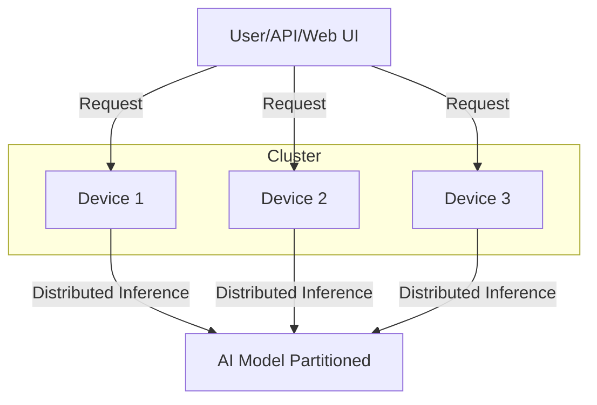

# Architecture Overview

- EXO is a distributed AI inference framework that unifies heterogeneous devices (Mac, Linux, Raspberry Pi, etc.) into a single cluster.
- Devices connect peer-to-peer (no master-worker), and models are partitioned across available memory.
- The architecture supports multiple inference engines (MLX, tinygrad, etc.).
- Device discovery is automatic, and the system is designed for minimal configuration.

# EXO High-Level Architecture

