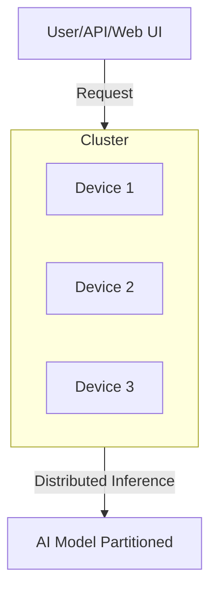
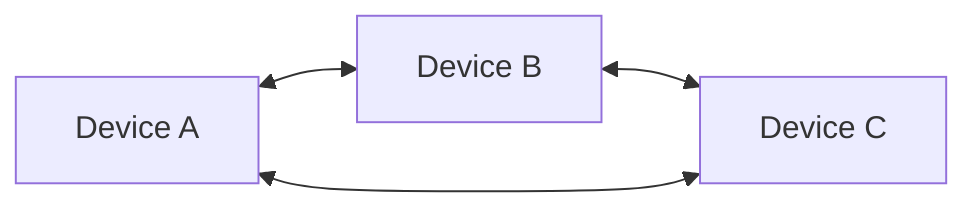

# Basic Diagrams

## EXO High-Level Architecture

```mermaid
flowchart TD
    User[User/API/Web UI]
    subgraph Cluster
      Device1[Device 1]
      Device2[Device 2]
      Device3[Device 3]
    end
    User -->|Request| Cluster
    Cluster -->|Distributed Inference| Model[AI Model Partitioned]
```

## Device Discovery and P2P Network

```mermaid
flowchart LR
    DeviceA[Device A]
    DeviceB[Device B]
    DeviceC[Device C]
    DeviceA <--> DeviceB
    DeviceB <--> DeviceC
    DeviceC <--> DeviceA
```
