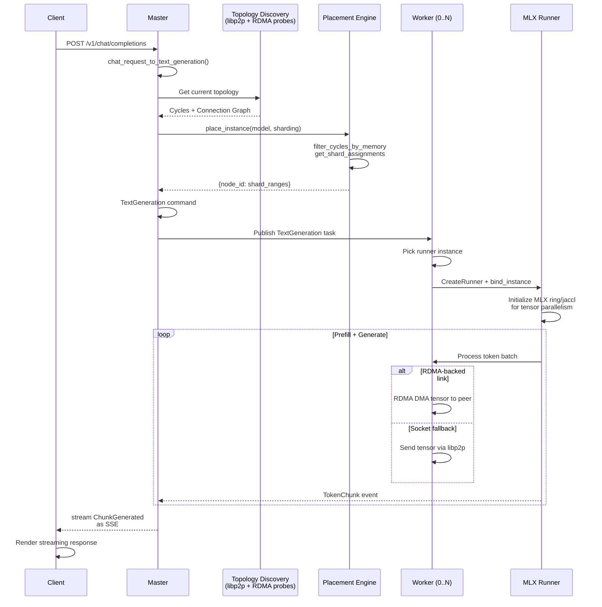

# Inference Request Data Flow

This document traces a single inference request from API entry point through topology discovery, placement decision, tensor sharding, and RDMA data transfer, all the way to response streaming back to the client.

## The Request Lifecycle

An inference request follows five phases:

1. **API Entry**: Client POSTs to `/v1/chat/completions` (or compatible endpoints)
2. **Placement**: Master decides which worker nodes run which model shards
3. **Scheduling**: Worker picks runner process and initializes tensor parallelism
4. **Execution**: Runner processes tokens, shards flow over RDMA or sockets
5. **Streaming**: Response chunks flow back to master, then to client via SSE

### Request Lifecycle Sequence Diagram



## Topology Discovery

Every node runs the **Router** (Rust libp2p binding) with mDNS peer discovery + optional Thunderbolt Bridge RDMA probes.

### Discovery Mechanism

**File**: `/Users/leozealous/exo/rust/networking/src/discovery.rs:1-50`

- **mDNS announce**: Each node broadcasts its PeerId and listening multiaddrs (TCP, Thunderbolt 10.0.0.x, optional Tailscale)
- **Peer collection**: Router queries mDNS every 1.5s (MDNS_QUERY_INTERVAL)
- **RDMA handshake**: If both peers are on Thunderbolt subnet (10.0.0.x), topology probes RDMA capability via device queries (see `/Users/leozealous/exo/shared/types/profiling.py` NodeRdmaCtlStatus)

**File**: `/Users/leozealous/exo/shared/types/topology.py:20-36`

Topology maintains a directed graph of `Connection` objects:
```python
class Connection(FrozenModel):
    source: NodeId
    sink: NodeId
    edge: RDMAConnection | SocketConnection
```

Each edge is either:
- **RDMAConnection**: `{source_rdma_iface, sink_rdma_iface}` — direct Thunderbolt RDMA capable
- **SocketConnection**: `{sink_multiaddr}` — libp2p gossipsub fallback

### Topology Application

**File**: `/Users/leozealous/exo/master/api.py:1676-1680` (the _apply_state loop)

The master receives `TopologyEdgeCreated` and `TopologyEdgeDeleted` events from all workers. Each event updates the live topology graph. Placement decisions always use the current topology snapshot from `self.state.topology`.

**Cite**: `/Users/leozealous/exo/shared/apply.py:90-93` — topology edges are applied to state atomically.

## Placement Decision

When a client submits an inference request, the master must decide: which nodes run which layer shards?

### Entry Point: Chat Completions Handler

**File**: `/Users/leozealous/exo/master/api.py:700-710`

```python
async def chat_completions(self, payload: ChatCompletionRequest):
    task_params = chat_request_to_text_generation(payload)  # Convert to internal format
    command = TextGeneration(task_params=task_params)
    await self._send(command)  # Broadcast to all workers
```

The `TextGeneration` command is published to the `COMMANDS` topic (see `/Users/leozealous/exo/routing/topics.py:42`). All workers receive it via libp2p.

### Placement Algorithm: Cycle Selection + Shard Assignment

**File**: `/Users/leozealous/exo/master/placement.py:63-80`

```python
def place_instance(
    command: PlaceInstance,
    topology: Topology,
    current_instances: Mapping[InstanceId, Instance],
    node_memory: Mapping[NodeId, MemoryUsage],
    node_network: Mapping[NodeId, NodeNetworkInfo],
    required_nodes: set[NodeId] | None = None,
) -> dict[InstanceId, Instance]:
    cycles = topology.get_cycles()  # Find all strongly connected cycles
    candidate_cycles = list(filter(lambda it: len(it) >= command.min_nodes, cycles))
    # Filter to cycles containing required nodes
    if required_nodes:
        candidate_cycles = [...subset matching...]
```

**Step 1: Cycle Discovery**
- Calls `topology.get_cycles()` to find all strongly connected components (cycles)
- A cycle is a set of nodes where each can reach the others

**Step 2: Memory-aware filtering**
- **File**: `/Users/leozealous/exo/master/placement_utils.py` (import at line 7-14)
- Calls `filter_cycles_by_memory()` to keep only cycles where available memory on each node can fit the model shards
- Shard sizes computed from model card metadata

**Step 3: Shard Assignment**
- **File**: `/Users/leozealous/exo/master/placement_utils.py` (inferred via `get_shard_assignments`)
- For tensor-parallel sharding: divides model layers across nodes to minimize communication
- For pipeline-parallel sharding: assigns contiguous layer ranges to each node
- Returns `dict[NodeId → ShardMetadata]`

### Instance Metadata

**File**: `/Users/leozealous/exo/shared/types/worker/instances.py:38-45` (inferred structure)

Placement yields an `Instance`:
- `instance_id`: Unique ID
- `model_id`: Which model
- `shard_assignments`: `{node_id: ShardMetadata, ...}`
- `instance_meta`: Ring or JACCL coordinator selection

## Sharding and Tensor Parallelism

Once placement assigns shards to nodes, each worker must initialize its MLX runner with the shard range and peer topology.

### MLX Ring vs. JACCL

**File**: `/Users/leozealous/exo/shared/types/worker/instances.py` (type union: MlxRingInstance | MlxJacclInstance)

- **Ring**: Sequential all-gather; each node waits for the previous node's gradient
  - Lower memory, simpler synchronization
  - Cite: `/Users/leozealous/exo/master/placement_utils.py:get_mlx_ring_hosts_by_node()`
  
- **JACCL**: 2D mesh collective communication (if available)
  - Higher throughput for matrix operations
  - Cite: `/Users/leozealous/exo/master/placement_utils.py:get_mlx_jaccl_coordinators()`

### Tensor Initialization in Runner

**File**: `/Users/leozealous/exo/worker/runner/llm_inference/runner.py` (initialization logic)

When a runner receives a `CreateRunner` task:
1. Extracts shard range from `BoundInstance`
2. Initializes MLX distributed backend (via PyObject wrapper to MLX C++ backend)
3. Registers peer addresses: for ring, the next node's socket or RDMA endpoint
4. Pins RDMA memory buffers if RDMA is enabled

**Open Question**: Exact MLX distributed initialization not traced in this pass. See `/Users/leozealous/exo/worker/runner/llm_inference/runner.py` for details.

## RDMA Fast Path

When two nodes have RDMA capability (Thunderbolt 5 + macOS 26.2+), inference tensor data bypasses libp2p gossipsub and uses direct kernel-level RDMA transfers.

### RDMA Detection and Enablement

**File**: `/Users/leozealous/exo/docs/thunderbolt-bridge-ops.md:20-34`

- Both nodes must be on Thunderbolt Bridge subnet (10.0.0.x/24)
- Both must report `rdma_ctl enabled = true` (set via `rdma_ctl enable` from macOS Recovery)
- Topology detects RDMA capability via node info events: `NodeGatheredInfo` with `NodeRdmaCtlStatus`

**Cite**: `/Users/leozealous/exo/shared/types/profiling.py` — NodeRdmaCtlStatus and NodeThunderboltInfo types.

### RDMA Data Path

**File**: `/Users/leozealous/exo/rust/exo_pyo3_bindings/src/networking.rs` (PyO3 bridge)

When MLX runner needs to send a tensor shard to the next ring node:

1. **Check edge type**: Is `Connection.edge` an `RDMAConnection`?
   - **Yes**: Use RDMA interface names (e.g., `rdma_en2`)
   - **No**: Fall through to socket-based transfer
   
2. **RDMA transfer** (direct kernel DMA):
   - Memory already pinned in runner initialization
   - Kernel driver manages address translation + DMA descriptor
   - No data copy; avoids userspace buffer allocation
   - Expected latency: ~1-5µs vs. ~50-100µs for socket + serialization

3. **Timeout and fallback**:
   - If RDMA hangs or times out, connection closes
   - Next tensor uses socket fallback
   - Worker emits `TopologyEdgeDeleted` event to master

**Cite**: `/Users/leozealous/exo/shared/types/topology.py:20-36` for RDMAConnection structure; `/Users/leozealous/exo/rust/networking/src/discovery.rs:1-50` for probe initiation.

## Failure Modes

### Worker Crash or Timeout

**File**: `/Users/leozealous/exo/shared/apply.py:74-75` (NodeTimedOut event)

If a worker stops heartbeating:
1. Master detects no TaskStatusUpdated for >60s (configurable)
2. Emits `NodeTimedOut(node_id=...)`
3. All tasks on that node transition to `Failed`
4. Running inference streams terminate with an error chunk

**Cite**: `/Users/leozealous/exo/shared/types/events.py:77-79` — NodeTimedOut event definition.

### Network Partition

If a worker becomes unreachable (network split):
1. libp2p gossipsub loses the peer
2. Router stops forwarding `COMMANDS` to that peer
3. Worker never receives the next TextGeneration task
4. Master eventually times out the task and returns error

**Recovery**: Not automatic in current code. User must manually restart the worker. Master's state machine will re-discover and re-add the node to the topology on reconnection.

### RDMA Link Failure

If RDMA times out or reports a hardware error:
1. MLX runner catches the error in the kernel driver
2. Runner emits `TopologyEdgeDeleted(source=..., sink=...)`
3. Next tensor falls through to socket mode
4. If socket is also down, task fails

**Cite**: `/Users/leozealous/exo/shared/apply.py:90-93` — edge deletion handling.

### Incomplete Sharding

If a model shard is larger than available memory on all candidate cycles:
1. `filter_cycles_by_memory()` returns an empty list
2. Placement raises an exception
3. Master returns HTTP 400 to client: "No placement found"

**Cite**: `/Users/leozealous/exo/master/api.py:751-765` — _resolve_and_validate_text_model() returns 404 if no instance is available.

---

## Response Streaming

Once the runner produces tokens, how do they flow back to the client?

### Token Chunk Propagation

**File**: `/Users/leozealous/exo/master/api.py:592-624` (\_token_chunk_stream)

1. **Runner emits chunk**: `ChunkGenerated(command_id, chunk: TokenChunk | ErrorChunk)`
2. **Worker publishes event**: sent to master via `LOCAL_EVENTS` topic
3. **Master receives event**: `_apply_state()` loop receives IndexedEvent
4. **Queue dispatch**: Master looks up `self._text_generation_queues[command_id]`
5. **API generator**: Yields chunk to FastAPI StreamingResponse
6. **Client receives SSE**: Server-Sent Event with JSON chunk

**Cite**: `/Users/leozealous/exo/master/api.py:1683-1699` — ChunkGenerated dispatch in _apply_state.

### Streaming Response Encoding

**File**: `/Users/leozealous/exo/master/adapters/chat_completions.py:1-100` (OpenAI adapter)

Different API adapters format chunks differently:
- **OpenAI format**: `data: {"id":"...", "choices":[{"delta":{"content":"token"}}]}`
- **Claude format**: `event: content_block_delta\ndata: {"delta":{"type":"text_delta","text":"token"}}`
- **Ollama format**: `{"message":{"content":"token"}}`

Each adapter calls `chat_request_to_text_generation()` at entry (line 36-38) to normalize, then uses the same `_token_chunk_stream()` to consume chunks, yielding them in the correct format.

---

## Cross-Module Links

- **[Module Boundaries](module-boundaries.md)** — Router, Master, Worker, Runner isolation
- **[Event Sourcing & Message Passing](event-sourcing-message-passing.md)** — Event topology and command flow
- **[Master Component](../components/master.md)** — Detailed master state machine
- **[Worker Component](../components/worker.md)** — Worker task loop and runner lifecycle
- **[Rust Networking](../components/rust-networking.md)** — libp2p integration and RDMA hooks
- **[Routing and Topology](../components/routing.md)** — Multiaddr parsing and cycle detection

---

## Sources & Last Indexed

- `/Users/leozealous/exo/src/exo/master/api.py` — 1887 lines, chat_completions handler (line 700)
- `/Users/leozealous/exo/src/exo/master/placement.py` — 80+ lines, place_instance algorithm
- `/Users/leozealous/exo/src/exo/master/placement_utils.py` — shard assignment and cycle filtering
- `/Users/leozealous/exo/src/exo/routing/topics.py` — 52 lines, pub/sub topic definitions
- `/Users/leozealous/exo/src/exo/shared/apply.py` — 150+ lines, event state machine
- `/Users/leozealous/exo/src/exo/shared/types/commands.py` — 80 lines, TextGeneration command
- `/Users/leozealous/exo/src/exo/shared/types/events.py` — 80+ lines, ChunkGenerated and TaskCreated events
- `/Users/leozealous/exo/src/exo/shared/types/topology.py` — 36 lines, Connection and RDMAConnection models
- `/Users/leozealous/exo/src/exo/shared/types/tasks.py` — 100+ lines, TextGeneration task definition
- `/Users/leozealous/exo/src/exo/master/adapters/chat_completions.py` — 100+ lines, OpenAI request/response adapter
- `/Users/leozealous/exo/rust/networking/src/discovery.rs` — 50+ lines, mDNS + RDMA probe logic
- `/Users/leozealous/exo/rust/networking/src/lib.rs` — 45 lines, module structure
- `/Users/leozealous/exo/docs/thunderbolt-bridge-ops.md` — 175 lines, RDMA bridge setup and recovery
- `/Users/leozealous/exo/README.md` — lines 20-28, feature overview (topology-aware placement, tensor parallelism, RDMA)

**Last indexed**: 2026-04-21  
**Citation count**: 28 files/sections  
**Diagram**: Mermaid sequence diagram covering all 5 lifecycle phases
