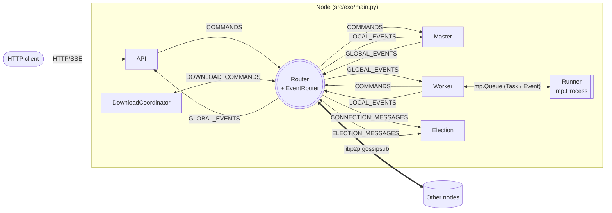
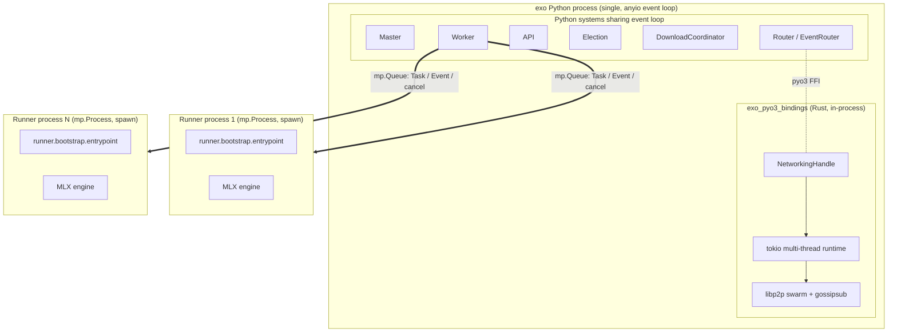
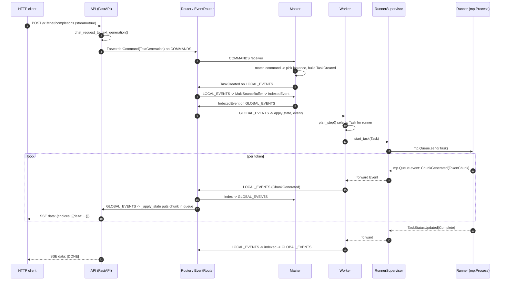
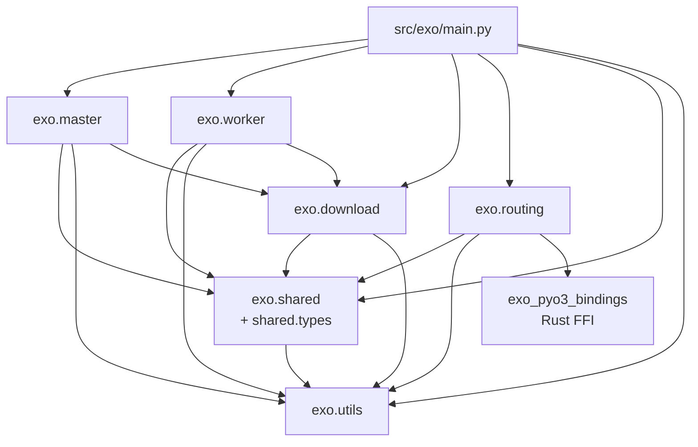
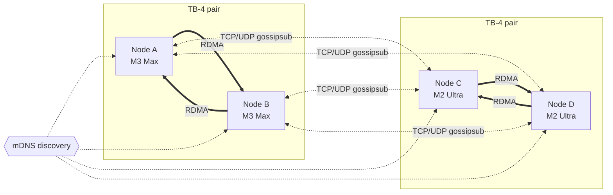
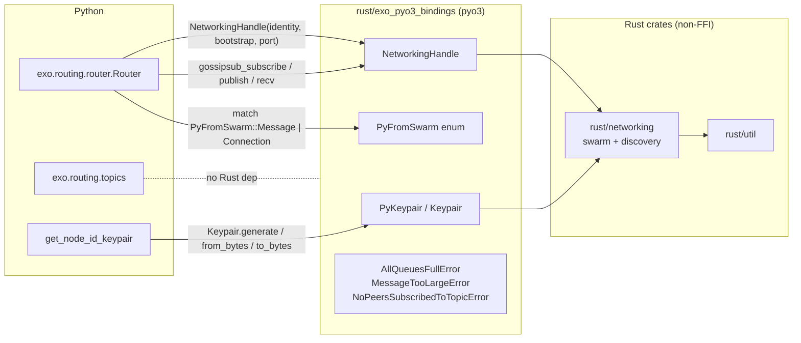

# Architecture Diagrams

Visual reference for EXO's runtime structure. Start here to orient yourself, then drill into [module-boundaries.md](./module-boundaries.md), [data-flow.md](./data-flow.md), [event-sourcing-message-passing.md](./event-sourcing-message-passing.md), or the per-system deep dives in [../components/](../components/).

Every diagram below is anchored to a code citation. If a diagram ever drifts from the source, the citation is the ground-truth.

---

## System topology

The 5 systems named in [docs/architecture.md:9-29](../../architecture.md) (Master, Worker, Runner, API, Election) plus the Router that glues them together. Each arrow is a topic send/receive pair; the Router is the in-process fan-out layer over libp2p gossipsub.

Caption: Every node wires Router + EventRouter + Election unconditionally; Master/Worker/API/DownloadCoordinator are conditional on flags (`src/exo/main.py:46-142`, `src/exo/main.py:144-159`). The 6 topics (GLOBAL_EVENTS, LOCAL_EVENTS, COMMANDS, ELECTION_MESSAGES, CONNECTION_MESSAGES, DOWNLOAD_COMMANDS) are defined in `src/exo/routing/topics.py:40-51`. Master reads LOCAL_EVENTS, writes GLOBAL_EVENTS (`src/exo/master/main.py:386-411`); Workers/API are the inverse (`src/exo/master/api.py:1676-1699`, `src/exo/worker/main.py:119-135`).

---

## Process model

A single `exo` invocation is one Python process hosting the systems above. The Runner is the sole exception: it's a `multiprocessing.Process` (spawn method) so a crashing inference job can't take the Worker down. The Router calls into Rust through pyo3 bindings, and Rust owns its own tokio runtime on a separate thread pool.

Caption: `mp.set_start_method("spawn", force=True)` is set globally at process entry (`src/exo/main.py:279`), guaranteeing Runner processes start fresh (no fork-inherited GPU/MLX state). `RunnerSupervisor.create` constructs three `mp_channel` pairs and a `daemon=True` `mp.Process` targeting `runner.bootstrap.entrypoint` (`src/exo/worker/runner/runner_supervisor.py:72-109`). Python systems all share one anyio event loop, started by the `TaskGroup` in `Node.run` (`src/exo/main.py:144-159`). The Rust tokio runtime is initialized once per process in `main_module` (`rust/exo_pyo3_bindings/src/lib.rs:155-172`).

---

## Request lifecycle

End-to-end sequence for a streaming chat completion: HTTP client → API adapter → Master (via COMMANDS) → Worker (via GLOBAL_EVENTS) → Runner (via `mp.Queue`) → token events back up the stack. This is the hottest path in the system.

Caption: API's `chat_completions` converts the OpenAI request via `chat_request_to_text_generation`, sends a `TextGeneration` command, and returns `StreamingResponse` over `_token_chunk_stream` (`src/exo/master/api.py:700-733`). Master's `_command_processor` picks the least-loaded instance and emits `TaskCreated` (`src/exo/master/main.py:117-170`). Master indexes local events via `MultiSourceBuffer` and republishes as `GlobalForwarderEvent` (`src/exo/master/main.py:386-423`). Worker's `_event_applier` folds events into `State` then `plan_step` hands a `Task` to the supervisor (`src/exo/worker/main.py:119-163`). `RunnerSupervisor._forward_events` streams events back out of the runner process (`src/exo/worker/runner/runner_supervisor.py:188-214`). API's `_apply_state` pushes `ChunkGenerated` chunks into the per-command queue backing the SSE stream (`src/exo/master/api.py:1676-1699`).

---

## Module dependency graph

Directory-level Python import graph within `src/exo/`. `shared` (types + apply + election + constants) is the foundation; `routing` depends only on `shared` + `utils`; `master`, `worker`, `download` sit on top; `main.py` wires everything.

Caption: Verified by grepping top-level imports at each subpackage. `src/exo/main.py:13-27` imports from every sibling except `exo.shared.types` internals. `routing/router.py:17-31` is the only module in pure-Python land that imports `exo_pyo3_bindings`. `master/main.py:1-65` and `worker/main.py:1-49` depend on `shared.types.*` + `utils` + `download.*` (via `worker` downloading models and `master` reading downloads into state). `shared` never imports from `master`/`worker`/`routing` — enforced by code review, since a backward dep would create a cycle.

---

## Network topology

How nodes actually wire up at the physical layer. Thunderbolt-4 links between directly connected Apple Silicon devices become `RDMAConnection` edges (used by MLX ring/jaccl for model sharding); everything else (Wi-Fi, Ethernet, TB hops over TCP) becomes a `SocketConnection` edge (used for gossipsub traffic). A 4-node cluster with two Thunderbolt pairs and fallback TCP in between:

Caption: `Connection` is `source: NodeId, sink: NodeId, edge: RDMAConnection | SocketConnection` (`src/exo/shared/types/topology.py:32-35`). `RDMAConnection` carries the source/sink RDMA interface names (`topology.py:20-22`); `SocketConnection` only carries the sink's `Multiaddr` (`topology.py:25-29`). mDNS-discovered links are written to `CONNECTION_MESSAGES` (policy `Never` — node-local only) by the networking subsystem (`src/exo/routing/topics.py:46-48`, `docs/architecture.md:72-73`). Placement decisions read `self.state.topology` to prefer RDMA-connected node groups when sharding an instance (`src/exo/master/main.py:293-304`).

---

## Python ↔ Rust FFI boundary

Everything crossing the language boundary goes through `exo_pyo3_bindings`, which is the only pyo3 crate and the only Python import target. The `networking` Rust crate is the libp2p swarm; `util` and `system_custodian` are pure-Rust helpers consumed only by the bindings crate.

Caption: The Rust entry point is `#[pymodule] fn main_module` in `rust/exo_pyo3_bindings/src/lib.rs:151-172`, which registers `PyKeypair` and the networking submodule. Python imports are concentrated in `src/exo/routing/router.py:17-24`: `AllQueuesFullError`, `Keypair`, `MessageTooLargeError`, `NetworkingHandle`, `NoPeersSubscribedToTopicError`, `PyFromSwarm`. `NetworkingHandle` methods `gossipsub_subscribe`, `gossipsub_unsubscribe`, `gossipsub_publish`, and `recv` are the entire hot-path API used by `Router._networking_subscribe/_networking_publish/_networking_recv` (`src/exo/routing/router.py:195-237`). The `networking` crate's swarm (`rust/networking/src/lib.rs:1-8` and `swarm.rs`/`discovery.rs`) is wrapped but not directly imported from Python.

---

Sources: src/exo/main.py:1-310, src/exo/routing/topics.py:14-51, src/exo/routing/router.py:17-238, src/exo/routing/event_router.py:1-55, src/exo/master/main.py:68-423, src/exo/master/api.py:197-735, src/exo/master/api.py:1641-1700, src/exo/worker/main.py:52-163, src/exo/worker/runner/runner_supervisor.py:52-214, src/exo/shared/types/topology.py:1-35, rust/exo_pyo3_bindings/src/lib.rs:150-172, rust/networking/src/lib.rs:1-44, docs/architecture.md:1-85

Last indexed: 2026-04-21 (commit c0d5bf92)
