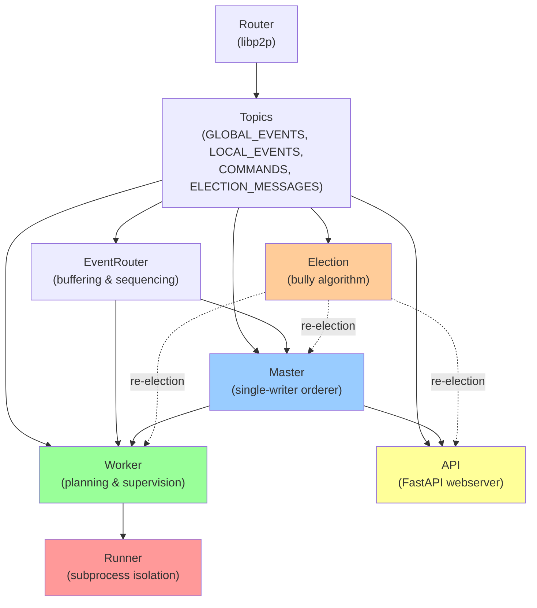

# Module Boundaries

The exo cluster runs as a single **Node** process per machine, but internally decomposes into 5 major **systems** that communicate through typed pub/sub messaging. This page documents how those systems are separated, what each one does, and how they talk.

## The 5 Systems

### Master
**Location:** `src/exo/master/main.py`

The Master is the single-writer orderer for the cluster. It runs on one elected node and is responsible for:
- Accepting commands from the Worker and API (placement requests, task creation, etc.)
- Reading and ordering events from all nodes via `LOCAL_EVENTS` topic
- Applying those events to a global `State` using pure `apply()` functions
- Writing the ordered event log to disk
- Broadcasting indexed events to all workers via `GLOBAL_EVENTS` topic

The Master is stateful—it holds the `State` and the event log—and ensures that all nodes eventually converge to the same state via event sourcing. Only one Master exists at a time; the election system selects which node runs it.

**Key files:** `src/exo/master/main.py:68-450`, `src/exo/master/event_log.py`

---

### Worker
**Location:** `src/exo/worker/main.py`

The Worker runs on every node and manages local inference execution. It is responsible for:
- Gathering system information (CPU, GPU, memory, network) and sending it as events
- Receiving events from Master and folding them into a local copy of `State`
- Planning what work should run locally (which model instances, which shards)
- Spawning and supervising Runner processes for inference jobs
- Sending task updates, errors, and completion events back to Master

The Worker reacts to State changes—when Master places a model instance on this node, the Worker's planner creates a Runner process to load and execute it. The Worker is not stateful in the traditional sense; it reconstructs its understanding by reading the event stream.

**Key files:** `src/exo/worker/main.py:52-100`, `src/exo/worker/plan.py`, `src/exo/worker/runner/runner_supervisor.py`

---

### Runner
**Location:** `src/exo/worker/runner/` (subprocess, not imported directly)

The Runner is an isolated child process spawned by the Worker for **fault tolerance**. It is responsible for:
- Loading a model onto device(s)
- Executing inference tasks (text generation, image generation, image edits)
- Streaming token chunks back to the parent Worker process via multiprocessing channels
- Handling inference errors without crashing the parent Worker

The Runner runs in a separate process (`multiprocessing.Process`) so that GPU out-of-memory errors, CUDA panics, or inference hangs do not crash the Worker. If a Runner dies, the Worker can supervise its restart. This is the primary fault-isolation boundary in exo.

**Key files:** `src/exo/worker/runner/runner_supervisor.py:52-102`, `src/exo/worker/runner/bootstrap.py`, `src/exo/worker/runner/llm_inference/`

---

### API
**Location:** `src/exo/master/api.py`

The API is a FastAPI webserver that exposes exo's state and commands to client applications. It is responsible for:
- Running an HTTP server on a configurable port (default 52415)
- Accepting requests in multiple formats (OpenAI Chat Completions, Claude Messages, Ollama, etc.)
- Converting external API requests to internal command types via adapters
- Reading event streams to build response payloads (streaming or batch)
- Serving the Svelte dashboard UI static files

The API runs on every node but typically only one node has `--spawn-api` enabled in production. It does not hold state directly; it reads events to construct responses on demand.

**Key files:** `src/exo/master/api.py:1-150`, `src/exo/master/adapters/`

---

### Election
**Location:** `src/exo/shared/election.py`

The Election system implements a distributed bully algorithm to elect a Master when a cluster starts or when the current Master fails. It is responsible for:
- Exchanging `ElectionMessage`s with all peers using the `ELECTION_MESSAGES` topic
- Tracking node seniority, election clock, and command counts
- Determining when a new Master should be elected
- Publishing `ElectionResult` events that trigger Worker, API, and Master restart/promotion/demotion

Every node runs an Election instance. When the elected Master changes, the Node orchestrates a coordinated shutdown and restart of affected systems (see `src/exo/main.py:169-270` for the `_elect_loop`).

**Key files:** `src/exo/shared/election.py:48-80`, `src/exo/shared/types/commands.py` (for command tracking)

---

## Dependency Graph

**Legend:**
- Solid arrows = data dependency (one system reads or commands another)
- Dashed arrows = control flow (election triggers system restart)
- Red box = isolated process boundary

---

## How They Communicate

All inter-system communication flows through **typed pub/sub topics** provided by the Router (a libp2p gossipsub wrapper).

### Message Topics (5 total)

| Topic | Direction | Content | Subscribers | Publishers |
|-------|-----------|---------|-------------|-----------|
| `GLOBAL_EVENTS` | Master → All | Ordered, indexed events; State updates | Worker, API, (Master reads back for its own session convergence) | Master |
| `LOCAL_EVENTS` | All → Master | Unordered events from nodes; system telemetry | Master | Worker, API, Election |
| `COMMANDS` | Worker/API → Master | Imperative instructions; placement requests, task creation | Master | Worker, API, Election (nack requests) |
| `ELECTION_MESSAGES` | All ↔ All | Candidate broadcasts; seniority, clock, session proposal | Election | Election |
| `CONNECTION_MESSAGES` | (local only) | libp2p peer join/leave events | Election, (route discovery) | Router |

**Event Sourcing Model:** Commands are stateless requests; Events are immutable facts. Master indexes events and broadcasts them; Workers apply events to reconstruct State locally.

**Reference:** See `docs/event-sourcing-message-passing.md` for detailed message protocol and acknowledgment semantics.

---

## Process Boundaries

### Same Process
- **Master, Worker, API, Election, EventRouter, Router** all run as tasks (async coroutines) in a single **Node process** per machine.
- They share memory and coordinate via async channels.
- If any crashes, the entire node restarts.

### Isolated Process
- **Runner** is spawned as a child process via `multiprocessing.Process` by the Worker.
- It communicates with the Worker via **multiprocessing channels** (`mp_channel[Event]`, `mp_channel[Task]`), not the pub/sub network.
- If a Runner dies, the Worker detects it and can restart just that Runner, not the entire node.
- Multiple Runners can run per node (one per model instance shard).

**Enforcing isolation:** The Runner subprocess has a different memory space and is created with `mp.set_start_method("spawn", force=True)` (see `src/exo/main.py:279`). The Worker holds `RunnerSupervisor` instances in a dict keyed by `RunnerId` (see `src/exo/worker/main.py:71`).

---

## Election Protocol

The Election system follows a **bully algorithm** where each node is assigned a **seniority** score. When multiple nodes claim to be Master (at startup or after partition healing), they exchange `ElectionMessage`s:

1. Each node computes a candidate score from: `(election_clock, seniority, commands_seen, master_node_id)`
2. Nodes publish their best candidate via `ELECTION_MESSAGES`
3. The node with the highest score wins and is elected Master
4. Winning node publishes an `ElectionResult` with `is_new_master=True`
5. All nodes receive the result and trigger system reconfiguration (Master promotion/demotion, Worker/API restart)

**Seniority:** Can be forced high via `--force-master` flag (sets seniority to 1,000,000) to pin a specific node as Master.

**Reference:** Full protocol in `src/exo/shared/election.py:48-150` and associated test in `src/exo/shared/tests/test_election.py`.

---

## Adding a 6th System

To add a new system (e.g., a **Scheduler** that manages work queues independent of the Master), you would:

1. **Define its command and event types** in `src/exo/shared/types/` (new discriminant unions in `commands.py` and `events.py`)
2. **Create a class** (e.g., `Scheduler`) that takes `Sender[Event]`, `Receiver[IndexedEvent]`, and command receivers as constructor args
3. **Register it in the Node** (see `src/exo/main.py:30-40`) as a field, instantiate it in `Node.create()`, and spawn its task in `Node.run()` (line 145-159)
4. **Define its pub/sub topic** in `src/exo/routing/topics.py` (if it needs network publishing; use `PublishPolicy.Never` for local-only)
5. **Wire up election callbacks** if the Scheduler needs to participate in re-election (e.g., shutting down when elected Master changes)

The key seams are:
- The `Node` dataclass coordinates all systems via TaskGroup
- The `EventRouter` provides a standardized event buffering and replay interface
- The `Router` / `topics` define the network boundary
- The `Election` system triggers reconfiguration via callbacks

---

## Sources

- `src/exo/main.py:1-414` — Node orchestration, system instantiation, election loop
- `src/exo/master/main.py:68-450` — Master single-writer ordering, event indexing
- `src/exo/worker/main.py:52-100` — Worker init, planning, and supervision
- `src/exo/worker/runner/runner_supervisor.py:52-102` — Runner lifecycle and isolation
- `src/exo/master/api.py:1-150` — API webserver and request adapters
- `src/exo/shared/election.py:48-80` — Election bully algorithm
- `src/exo/routing/topics.py:1-52` — Topic definitions and publish policies
- `src/exo/routing/event_router.py:1-167` — Event buffering, sequencing, and NACK retry
- `docs/architecture.md:1-85` — Original architecture overview

**Cross-references:**
- [Master Component](../components/master.md)
- [Worker Component](../components/worker.md)
- [Routing & Topics](../components/routing.md)
- [Shared Types](../components/shared.md)
- [Event Sourcing & Message Passing](event-sourcing-message-passing.md)

---

**Last indexed:** 2026-04-21 | **Citations:** 17
